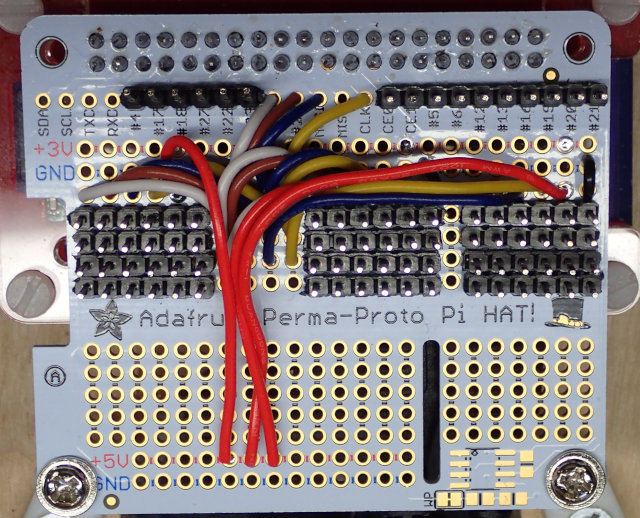

The easiest way to use ECL is by setting up a Raspberry Pi Zero-W as a controller for all the OLEDs, and have the host that is running your emulators send a request to the pi to change the labels.

## Hardware needed:

Raspberry Pi Zero-W
Adafruit Perma-Proto Hat (full size, not for the Zero)
A pile of SSD1331 OLED SPI displays
A pile of 6-pin dupont cables (female-to-female)
A pile of 1-pin dupont cables (female-to-female)

## Wiring

The HiLetgo 0.95" 7-pin 65k SPI SSD1331 OLED Display is what was used during development.   

ECL is expecting the display to be wired up as:

Common connections:

SPI Data/Command (DC) uses pi GPIO24
SPI Reset (RES) uses pi GPIO25
SPI data (SDA) uses pi MOSI
SPI clock (SCL) uses pi CLK
+5V (VCC)
Ground (GND)

SPI Chip Select (CS) is unique for each display.  You can use any available GPIO (there are 16 available).  The pi zero apparently can provide enough current to drive 12 OLED displays from it's 5V line, if using a good power supply.  

You should wire up rows of 6-pins on the Perma-Proto Hat that connect to the common connections in the order listed above, they match the order of the pins on the SPI displays.  You should also have pins soldered onto the free GPIO pins on the Perma-Proto Hat that can be used for connecting the Chip Select (the 7th pin on the display).  Here is an example of wiring up the Hat:

The DC line (white) is coming from the GPIO24 pin, which is connected to a column of pads then each bank gets a line run from this column.
The RES line (dark red) is wired the same as the DC line, except from GPIO25.
The SDA line (blue) is wired the same as the DC line, except from MOSI.   
The SCL line (yellow) is wired the same as the DC line, except from CLK.
The +5V (red) is coming from the +5V row at the top of the hat.
The Ground (black) line is coming from the GND row just below the banks of pins.  

Using consistent wire color while soldering will help keep your sanity.  Leaving a gap column between the banks of pins will make it easier to plug in the dupont wires.  If you need more then 12 displays 

The dupont wires for the displays should all be the same length, this seems to help prevent excessive reflections.  This is a LOT of connections for an SPI bus, but it has been surprisingly stable in testing.  

## Software

Install Raspbian on the pi-zero.

